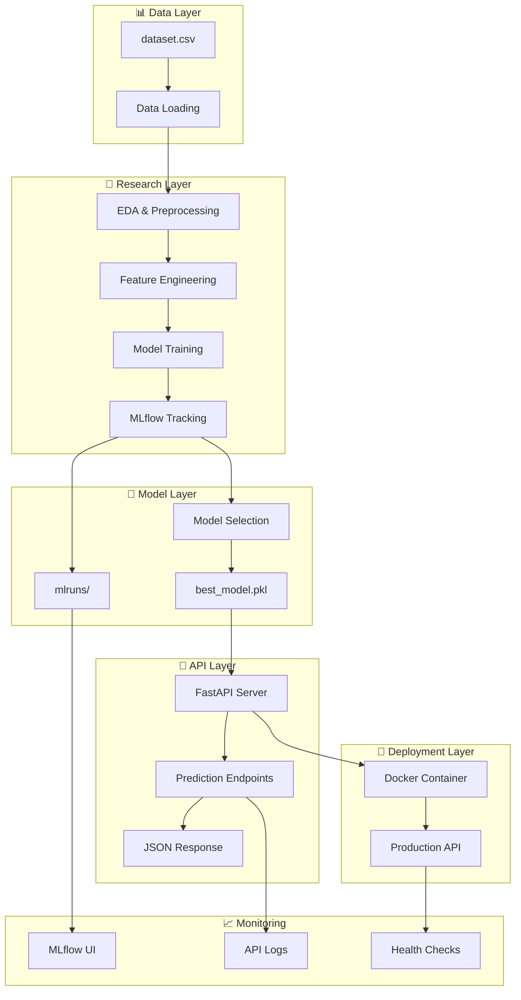

# 🎯 Customer Churn Prediction & MLflow Tracking

[](https://www.python.org/)
[](https://fastapi.tiangolo.com/)
[](https://mlflow.org/)
[](https://www.docker.com/)
[](LICENSE)

## 📋 Description

Ce projet implémente un **système complet de prédiction du churn bancaire** avec tracking MLflow et déploiement via API FastAPI. Il permet de prédire le risque de désabonnement des clients bancaires en utilisant des techniques de machine learning avancées.

## 🏗️ Architecture du Projet

```
customer-churn-mlflow-tracking/
│
├── 📊 DATA LAYER
│   └── data/
│       └── dataset.csv                 # Dataset de churn bancaire
│
├── 🔬 RESEARCH & DEVELOPMENT
│   └── notebooks/
│       ├── customer_churn_mlflow_pipeline.ipynb  # Pipeline ML complet
│       └── ReadData.ipynb             # Exploration des données
│
├── 🤖 MODEL LAYER
│   ├── models/
│   │   ├── best_model.pkl             # Meilleur modèle entraîné
│   │   └── best_model_metadata.json   # Métadonnées du modèle
│   └── mlruns/                        # Tracking MLflow
│       ├── 0/                         # Expérience par défaut
│       └── experiments/               # Expériences nommées
│
├── 🚀 API LAYER
│   └── Apis/
│       ├── churn_api.py               # API FastAPI principale
│       ├── test_api.py                # Tests de l'API
│       └── README.md                  # Documentation API
│
├── 📈 REPORTING LAYER
│   └── reports/
│       ├── confusion_matrices/        # Matrices de confusion
│       ├── roc_curves/               # Courbes ROC
│       └── model_comparison.html     # Rapport de comparaison
│
├── 🐳 DEPLOYMENT LAYER
│   ├── Dockerfile                    # Image Docker
│   ├── docker-compose.yml           # Orchestration
│   ├── .dockerignore               # Optimisation Docker
│   ├── test_data.json             # Données de test API
│   └── test_batch.json            # Tests en lot
│
├── 📦 CONFIGURATION
│   ├── requirements.txt            # Dépendances Python originales
│   ├── requirements_py313.txt     # Dépendances Python 3.13
│   └── .gitignore                 # Fichiers ignorés par Git
│
└── 📚 DOCUMENTATION
    ├── README.md                  # Ce fichier
    └── test-docker.py            # Tests Docker automatiques
```

## 🔄 Flux de Données et Architecture



## 🚀 Démarrage Rapide

### 1. Installation

```bash
# Cloner le repository
git clone <repository-url>
cd customer-churn-mlflow-tracking

# Installer les dépendances
pip install -r requirements_py313.txt
```

### 2. Entraînement du Modèle

```bash
# Lancer Jupyter
jupyter notebook

# Exécuter le notebook
notebooks/customer_churn_mlflow_pipeline.ipynb
```

### 3. Lancement de l'API

```bash
# Mode développement
cd Apis
python churn_api.py

# Avec Docker
docker-compose up -d
```

### 4. Test de l'API

```bash
# Test automatique
python test-docker.py

# Test manuel
curl -X GET "http://localhost:8000/health"
```

## 🔧 Composants Principaux

### 📊 Pipeline de Machine Learning

| Étape | Description | Outils |
|-------|-------------|--------|
| **Data Loading** | Chargement du dataset CSV | Pandas |
| **EDA** | Analyse exploratoire | Matplotlib, Seaborn |
| **Preprocessing** | Nettoyage et transformation | Sklearn Pipelines |
| **Feature Engineering** | Création de features | ColumnTransformer |
| **Imbalanced Data** | Gestion du déséquilibre | SMOTE, Class Weights |
| **Model Training** | Entraînement multi-modèles | LogisticRegression, RandomForest, XGBoost |
| **Evaluation** | Métriques et validation | Accuracy, F1-Score, ROC-AUC |
| **Tracking** | Suivi des expériences | MLflow |

### 🤖 Modèles Implémentés

```python
# Stratégies de déséquilibre testées
strategies = {
    "Baseline": "Aucune correction",
    "Class_Weight": "Pondération automatique", 
    "SMOTE": "Suréchantillonnage synthétique"
}

# Modèles comparés
models = {
    "LogisticRegression": "Modèle linéaire interprétable",
    "RandomForest": "Ensemble d'arbres de décision",
    "XGBoost": "Gradient boosting optimisé"
}
```

### 🚀 API Endpoints

| Endpoint | Méthode | Description |
|----------|---------|-------------|
| `/` | GET | Statut de l'API |
| `/health` | GET | Santé détaillée |
| `/predict` | POST | Prédiction individuelle |
| `/predict/batch` | POST | Prédictions en lot |
| `/model/info` | GET | Informations du modèle |
| `/test/sample` | GET | Test avec exemple |

## 📊 Utilisation de l'API

### Test Individuel

```bash
curl -X POST "http://localhost:8000/predict" \
  -H "Content-Type: application/json" \
  -d '{
    "CreditScore": 650,
    "Geography": "France", 
    "Gender": "Male",
    "Age": 35,
    "Tenure": 3,
    "Balance": 50000.0,
    "NumOfProducts": 2,
    "HasCrCard": 1,
    "IsActiveMember": 1,
    "EstimatedSalary": 75000.0
  }'
```

### Test en Lot

```bash
curl -X POST "http://localhost:8000/predict/batch" \
  -H "Content-Type: application/json" \
  -d @test_batch.json
```

### Réponse Type

```json
{
  "prediction": 0,
  "probability_no_churn": 0.85,
  "probability_churn": 0.15,
  "confidence_level": "Très confiant",
  "risk_category": "Risque faible"
}
```

## 🐳 Déploiement Docker

### Construction et Lancement

```bash
# Construction de l'image
docker build -t churn-prediction-api .

# Lancement du conteneur
docker run -d -p 8000:8000 churn-prediction-api

# Avec docker-compose (recommandé)
docker-compose up -d
```

### Services Disponibles

- **API de Prédiction**: `http://localhost:8000`
- **Documentation Swagger**: `http://localhost:8000/docs`
- **MLflow UI**: `http://localhost:5000` (avec `--profile mlflow`)

## 📈 Monitoring et MLflow

### Lancement de MLflow UI

```bash
# Local
mlflow ui --backend-store-uri file:///path/to/mlruns

# Docker
docker-compose --profile mlflow up -d
```

### Métriques Trackées

- **Hyperparamètres**: Configuration des modèles
- **Métriques**: Accuracy, F1-Score, ROC-AUC
- **Artefacts**: Matrices de confusion, courbes ROC
- **Modèles**: Pipelines complets sérialisés

## 🔍 Tests et Validation

### Tests Automatiques

```bash
# Tests de l'API locale
python Apis/test_api.py

# Tests de l'API Docker
python test-docker.py

# Tests avec données JSON
curl -X POST "http://localhost:8000/predict/batch" \
  -H "Content-Type: application/json" \
  -d @test_data.json
```

### Validation des Données

| Champ | Type | Plage | Description |
|-------|------|-------|-------------|
| `CreditScore` | int | 300-850 | Score de crédit |
| `Geography` | str | France/Spain/Germany | Pays |
| `Gender` | str | Male/Female | Genre |
| `Age` | int | 18-100 | Âge |
| `Tenure` | int | 0-10 | Ancienneté |
| `Balance` | float | ≥0 | Solde |
| `NumOfProducts` | int | 1-4 | Nb produits |
| `HasCrCard` | int | 0/1 | Carte crédit |
| `IsActiveMember` | int | 0/1 | Membre actif |
| `EstimatedSalary` | float | ≥0 | Salaire estimé |

## 📚 Documentation Technique

### Stack Technologique

- **Backend**: FastAPI + Uvicorn
- **ML**: Scikit-learn, XGBoost, Imbalanced-learn
- **Tracking**: MLflow
- **Data**: Pandas, NumPy
- **Viz**: Matplotlib, Seaborn
- **Deployment**: Docker, Docker Compose
- **API Testing**: Requests, Pydantic

### Structure des Modèles

```python
# Pipeline de préprocessing
preprocessor = ColumnTransformer([
    ('num', StandardScaler(), numeric_features),
    ('cat', OneHotEncoder(), categorical_features)
])

# Pipeline complet avec SMOTE
pipeline = ImbPipeline([
    ('preprocessor', preprocessor),
    ('smote', SMOTE(random_state=42)),
    ('classifier', model)
])
```

## 🚨 Dépannage

### Problèmes Courants

1. **Modèle non trouvé**
   ```bash
   # Vérifier l'existence
   ls -la models/best_model.pkl
   ```

2. **Port occupé**
   ```bash
   # Changer le port
   docker run -p 8001:8000 churn-prediction-api
   ```

3. **Erreurs de dépendances**
   ```bash
   # Réinstaller
   pip install -r requirements_py313.txt
   ```

## 🤝 Contribution

1. Fork le projet
2. Créer une branche feature (`git checkout -b feature/AmazingFeature`)
3. Commit les changements (`git commit -m 'Add AmazingFeature'`)
4. Push vers la branche (`git push origin feature/AmazingFeature`)
5. Ouvrir une Pull Request

## 📄 Licence

Ce projet est sous licence MIT. Voir le fichier `LICENSE` pour plus de détails.

## 👥 Équipe

- **Data Scientists**: Développement des modèles ML
- **ML Engineers**: Pipeline et déploiement
- **DevOps**: Infrastructure et monitoring

## 🔗 Liens Utiles

- [Documentation FastAPI](https://fastapi.tiangolo.com/)
- [MLflow Documentation](https://mlflow.org/docs/latest/index.html)
- [Scikit-learn User Guide](https://scikit-learn.org/stable/user_guide.html)
- [Docker Documentation](https://docs.docker.com/)

---
**🎉 Projet prêt pour la production avec tracking MLflow complet !**
